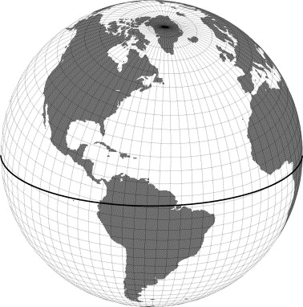
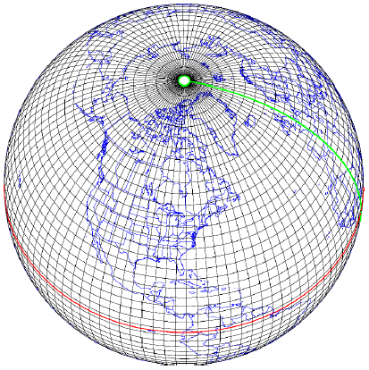

# pycesmLE: Manipulate CESM-LENS outputs

Data from CESM-LENS (CESM Large Ensemble) simulations are often not on longitude-latitude horizontal grids, or the standard pressure levels for the vertical coordinate. Instead, atmospheric data have a hybrid vertical coordinate and ocean/ice data have displaced-pole grids. In order to analyze data on regular grids, we can use pycesmLE to do the interpolation (and rotation for vector fields): given an input netcdf file that includes data on non-standard grids, it returns a new netcdf file with data on standard grids (i.e. longitude-latitude grids in the horizontal direction and pressure levels on the vertical direction).  

### Displaced-pole to latitude-longitude grids

##### Examples

[Ice Thickness on longitude-latitude Grids](examples/ice_thickness_on_lonlat_grids.py)

[Ice Velocity on longitude-latitude Grids](examples/ice_velocity_on_lonlat_grids.py)

### Hybrid to pressure levels
[http://www.cesm.ucar.edu/models/atm-cam/docs/usersguide/node25.html](http://www.cesm.ucar.edu/models/atm-cam/docs/usersguide/node25.html)

##### Example

[Geopotential Height at 500hPa](examples/500hPa_geopotential_height.py)
